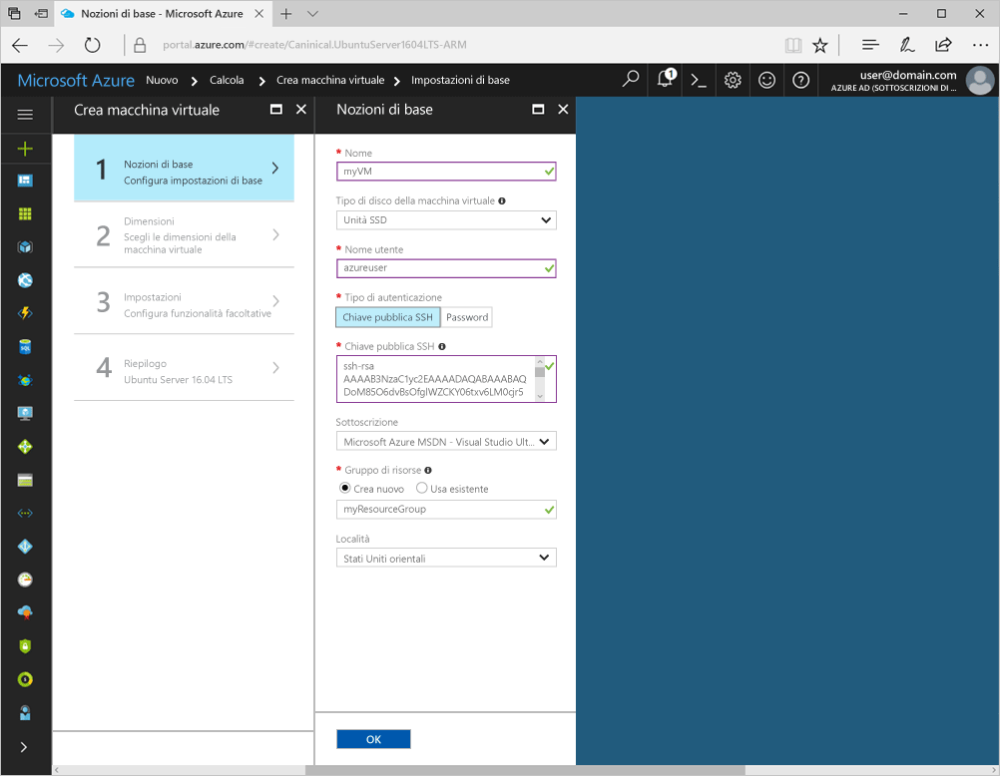
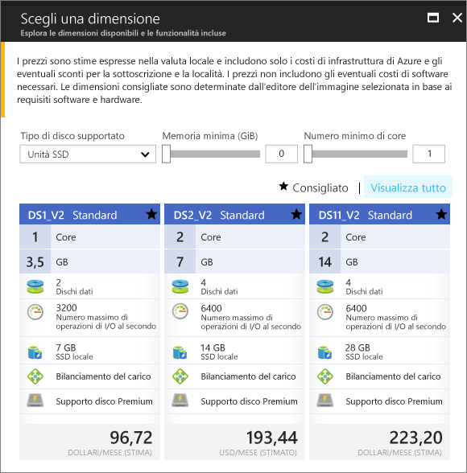

# <a name="create-a-linux-virtual-machine-with-hello-azure-portal"></a><span data-ttu-id="600fe-103">Creare una macchina virtuale Linux con hello portale di Azure</span><span class="sxs-lookup"><span data-stu-id="600fe-103">Create a Linux virtual machine with hello Azure portal</span></span>

<span data-ttu-id="600fe-104">Macchine virtuali di Azure può essere create tramite hello portale di Azure.</span><span class="sxs-lookup"><span data-stu-id="600fe-104">Azure virtual machines can be created through hello Azure portal.</span></span> <span data-ttu-id="600fe-105">Questo metodo fornisce un'interfaccia utente basata sul browser per la creazione e la configurazione delle macchine virtuali e di tutte le risorse correlate.</span><span class="sxs-lookup"><span data-stu-id="600fe-105">This method provides a browser-based user interface for creating and configuring virtual machines and all related resources.</span></span> <span data-ttu-id="600fe-106">Questa procedura di avvio rapido tramite la creazione di una macchina virtuale e l'installazione di un server Web in hello VM.</span><span class="sxs-lookup"><span data-stu-id="600fe-106">This Quickstart steps through creating a virtual machine and installing a webserver on hello VM.</span></span>

<span data-ttu-id="600fe-107">Se non si ha una sottoscrizione di Azure, creare un [account gratuito](https://azure.microsoft.com/free/?WT.mc_id=A261C142F) prima di iniziare.</span><span class="sxs-lookup"><span data-stu-id="600fe-107">If you don't have an Azure subscription, create a [free account](https://azure.microsoft.com/free/?WT.mc_id=A261C142F) before you begin.</span></span>

## <a name="create-ssh-key-pair"></a><span data-ttu-id="600fe-108">Creare una coppia di chiavi SSH</span><span class="sxs-lookup"><span data-stu-id="600fe-108">Create SSH key pair</span></span>

<span data-ttu-id="600fe-109">È necessario un toocomplete coppia di chiavi SSH questa Guida introduttiva.</span><span class="sxs-lookup"><span data-stu-id="600fe-109">You need an SSH key pair toocomplete this quick start.</span></span> <span data-ttu-id="600fe-110">Se è già disponibile una coppia di chiavi SSH, questo passaggio può essere ignorato.</span><span class="sxs-lookup"><span data-stu-id="600fe-110">If you have an existing SSH key pair, this step can be skipped.</span></span>

<span data-ttu-id="600fe-111">Da una shell Bash, eseguire questo comando e seguire hello le direzioni.</span><span class="sxs-lookup"><span data-stu-id="600fe-111">From a Bash shell, run this command and follow hello on-screen directions.</span></span> <span data-ttu-id="600fe-112">output del comando Hello include il nome file hello del file di chiave pubblica hello.</span><span class="sxs-lookup"><span data-stu-id="600fe-112">hello command output includes hello file name of hello public key file.</span></span> <span data-ttu-id="600fe-113">Copiare hello contenuto degli Appunti toohello di hello file di chiave pubblica.</span><span class="sxs-lookup"><span data-stu-id="600fe-113">Copy hello contents of hello public key file toohello clipboard.</span></span>

```bash
ssh-keygen -t rsa -b 2048
```

## <a name="log-in-tooazure"></a><span data-ttu-id="600fe-114">Accedi tooAzure</span><span class="sxs-lookup"><span data-stu-id="600fe-114">Log in tooAzure</span></span> 

<span data-ttu-id="600fe-115">Accedi toohello portale di Azure all'indirizzo http://portal.azure.com.</span><span class="sxs-lookup"><span data-stu-id="600fe-115">Log in toohello Azure portal at http://portal.azure.com.</span></span>

## <a name="create-virtual-machine"></a><span data-ttu-id="600fe-116">Crea macchina virtuale</span><span class="sxs-lookup"><span data-stu-id="600fe-116">Create virtual machine</span></span>

1. <span data-ttu-id="600fe-117">Fare clic su hello **New** pulsante disponibile nella hello angolo superiore sinistro del portale di Azure hello.</span><span class="sxs-lookup"><span data-stu-id="600fe-117">Click hello **New** button found on hello upper left-hand corner of hello Azure portal.</span></span>

2. <span data-ttu-id="600fe-118">Selezionare **Calcolo** e quindi **Ubuntu Server 16.04 LTS**.</span><span class="sxs-lookup"><span data-stu-id="600fe-118">Select **Compute**, and then select **Ubuntu Server 16.04 LTS**.</span></span> 

3. <span data-ttu-id="600fe-119">Immettere le informazioni di hello macchina virtuale.</span><span class="sxs-lookup"><span data-stu-id="600fe-119">Enter hello virtual machine information.</span></span> <span data-ttu-id="600fe-120">In **Tipo di autenticazione** selezionare **Chiave pubblica SSH**.</span><span class="sxs-lookup"><span data-stu-id="600fe-120">For **Authentication type**, select **SSH public key**.</span></span> <span data-ttu-id="600fe-121">Durante l'operazione Incolla nella propria chiave pubblica SSH, prestare attenzione tooremove tutti gli spazi iniziali o finali.</span><span class="sxs-lookup"><span data-stu-id="600fe-121">When pasting in your SSH public key, take care tooremove any leading or trailing white space.</span></span> <span data-ttu-id="600fe-122">Al termine fare clic su **OK**.</span><span class="sxs-lookup"><span data-stu-id="600fe-122">When complete, click **OK**.</span></span>

    

4. <span data-ttu-id="600fe-124">Selezionare una dimensione per hello macchina virtuale.</span><span class="sxs-lookup"><span data-stu-id="600fe-124">Select a size for hello VM.</span></span> <span data-ttu-id="600fe-125">Selezionare altre dimensioni, toosee **visualizzare tutti** o modificare hello **il tipo di disco supportati** filtro.</span><span class="sxs-lookup"><span data-stu-id="600fe-125">toosee more sizes, select **View all** or change hello **Supported disk type** filter.</span></span> 

      

5. <span data-ttu-id="600fe-127">Nel pannello impostazioni hello, mantenere i valori predefiniti di hello e fare clic su **OK**.</span><span class="sxs-lookup"><span data-stu-id="600fe-127">On hello settings blade, keep hello defaults and click **OK**.</span></span>

6. <span data-ttu-id="600fe-128">Nella pagina Riepilogo hello, fare clic su **Ok** distribuzione della macchina virtuale toostart hello.</span><span class="sxs-lookup"><span data-stu-id="600fe-128">On hello summary page, click **Ok** toostart hello virtual machine deployment.</span></span>

7. <span data-ttu-id="600fe-129">Hello VM sarà bloccato toohello dashboard del portale di Azure.</span><span class="sxs-lookup"><span data-stu-id="600fe-129">hello VM will be pinned toohello Azure portal dashboard.</span></span> <span data-ttu-id="600fe-130">Una volta completata la distribuzione di hello, verrà aperta automaticamente pannello riepilogo di hello macchina virtuale.</span><span class="sxs-lookup"><span data-stu-id="600fe-130">Once hello deployment has completed, hello VM summary blade automatically opens.</span></span>


## <a name="connect-toovirtual-machine"></a><span data-ttu-id="600fe-131">Connettere la macchina toovirtual</span><span class="sxs-lookup"><span data-stu-id="600fe-131">Connect toovirtual machine</span></span>

<span data-ttu-id="600fe-132">Creare una connessione SSH con la macchina virtuale hello.</span><span class="sxs-lookup"><span data-stu-id="600fe-132">Create an SSH connection with hello virtual machine.</span></span>

1. <span data-ttu-id="600fe-133">Fare clic su hello **Connetti** pulsante sul pannello delle macchine virtuali hello.</span><span class="sxs-lookup"><span data-stu-id="600fe-133">Click hello **Connect** button on hello virtual machine blade.</span></span> <span data-ttu-id="600fe-134">Hello connettersi pulsante consente di visualizzare una stringa di connessione SSH che può essere una macchina virtuale di toohello tooconnect utilizzato.</span><span class="sxs-lookup"><span data-stu-id="600fe-134">hello connect button displays an SSH connection string that can be used tooconnect toohello virtual machine.</span></span>

     

2. <span data-ttu-id="600fe-136">Comando che segue di esecuzione hello toocreate una sessione SSH.</span><span class="sxs-lookup"><span data-stu-id="600fe-136">Run hello following command toocreate an SSH session.</span></span> <span data-ttu-id="600fe-137">Sostituire la stringa di connessione hello con hello che uno è stato copiato da hello portale di Azure.</span><span class="sxs-lookup"><span data-stu-id="600fe-137">Replace hello connection string with hello one you copied from hello Azure portal.</span></span>

```bash 
ssh azureuser@40.112.21.50
```

## <a name="install-nginx"></a><span data-ttu-id="600fe-138">Installare NGINX</span><span class="sxs-lookup"><span data-stu-id="600fe-138">Install NGINX</span></span>

<span data-ttu-id="600fe-139">Seguente hello utilizzare origini dei pacchetti tooupdate script bash e installare il pacchetto NGINX più recente di hello.</span><span class="sxs-lookup"><span data-stu-id="600fe-139">Use hello following bash script tooupdate package sources and install hello latest NGINX package.</span></span> 

```bash 
#!/bin/bash

# update package source
sudo apt-get -y update

# install NGINX
sudo apt-get -y install nginx
```

<span data-ttu-id="600fe-140">Al termine, uscire dalla sessione SSH hello e restituire le proprietà della VM hello in hello portale di Azure.</span><span class="sxs-lookup"><span data-stu-id="600fe-140">When done, exit hello SSH session and return hello VM properties in hello Azure portal.</span></span>


## <a name="open-port-80-for-web-traffic"></a><span data-ttu-id="600fe-141">Aprire la porta 80 per il traffico Web</span><span class="sxs-lookup"><span data-stu-id="600fe-141">Open port 80 for web traffic</span></span> 

<span data-ttu-id="600fe-142">Un gruppo di sicurezza di rete (NSG) consente il traffico in ingresso e in uscita.</span><span class="sxs-lookup"><span data-stu-id="600fe-142">A Network security group (NSG) secures inbound and outbound traffic.</span></span> <span data-ttu-id="600fe-143">Quando una macchina virtuale viene creata dal portale di Azure hello, viene creata una regola in entrata sulla porta 22 per le connessioni SSH.</span><span class="sxs-lookup"><span data-stu-id="600fe-143">When a VM is created from hello Azure portal, an inbound rule is created on port 22 for SSH connections.</span></span> <span data-ttu-id="600fe-144">Poiché questa macchina virtuale ospita un server Web, una regola di gruppo deve toobe creato per la porta 80.</span><span class="sxs-lookup"><span data-stu-id="600fe-144">Because this VM hosts a webserver, an NSG rule needs toobe created for port 80.</span></span>

1. <span data-ttu-id="600fe-145">Nella macchina virtuale hello, fare clic sul nome hello di hello **gruppo di risorse**.</span><span class="sxs-lookup"><span data-stu-id="600fe-145">On hello virtual machine, click hello name of hello **Resource group**.</span></span>
2. <span data-ttu-id="600fe-146">Seleziona hello **il gruppo di sicurezza di rete**.</span><span class="sxs-lookup"><span data-stu-id="600fe-146">Select hello **network security group**.</span></span> <span data-ttu-id="600fe-147">Hello gruppo può essere identificato utilizzando hello **tipo** colonna.</span><span class="sxs-lookup"><span data-stu-id="600fe-147">hello NSG can be identified using hello **Type** column.</span></span> 
3. <span data-ttu-id="600fe-148">Nel menu a sinistra di hello, in impostazioni, fare clic su **sicurezza regole connessioni in entrata**.</span><span class="sxs-lookup"><span data-stu-id="600fe-148">On hello left-hand menu, under settings, click **Inbound security rules**.</span></span>
4. <span data-ttu-id="600fe-149">Fare clic su **Aggiungi**.</span><span class="sxs-lookup"><span data-stu-id="600fe-149">Click on **Add**.</span></span>
5. <span data-ttu-id="600fe-150">In **Nome** digitare **http**.</span><span class="sxs-lookup"><span data-stu-id="600fe-150">In **Name**, type **http**.</span></span> <span data-ttu-id="600fe-151">Assicurarsi che **intervallo di porte** è impostato too80 e **azione** è troppo**Consenti**.</span><span class="sxs-lookup"><span data-stu-id="600fe-151">Make sure **Port range** is set too80 and **Action** is set too**Allow**.</span></span> 
6. <span data-ttu-id="600fe-152">Fare clic su **OK**.</span><span class="sxs-lookup"><span data-stu-id="600fe-152">Click **OK**.</span></span>


## <a name="view-hello-nginx-welcome-page"></a><span data-ttu-id="600fe-153">Pagina iniziale di visualizzazione hello NGINX</span><span class="sxs-lookup"><span data-stu-id="600fe-153">View hello NGINX welcome page</span></span>

<span data-ttu-id="600fe-154">Con NGINX installato e la porta 80 aprire tooyour VM, server Web hello è ora possibile accedere da hello internet.</span><span class="sxs-lookup"><span data-stu-id="600fe-154">With NGINX installed, and port 80 open tooyour VM, hello webserver can now be accessed from hello internet.</span></span> <span data-ttu-id="600fe-155">Aprire un web browser e immettere l'indirizzo IP pubblico hello di hello macchina virtuale.</span><span class="sxs-lookup"><span data-stu-id="600fe-155">Open a web browser, and enter hello public IP address of hello VM.</span></span> <span data-ttu-id="600fe-156">indirizzo IP pubblico Hello è reperibile nel pannello VM hello in hello portale di Azure.</span><span class="sxs-lookup"><span data-stu-id="600fe-156">hello public IP address can be found on hello VM blade in hello Azure portal.</span></span>

 

## <a name="clean-up-resources"></a><span data-ttu-id="600fe-158">Pulire le risorse</span><span class="sxs-lookup"><span data-stu-id="600fe-158">Clean up resources</span></span>

<span data-ttu-id="600fe-159">Quando non è più necessario, eliminare il gruppo di risorse hello, macchina virtuale e tutte le risorse correlate.</span><span class="sxs-lookup"><span data-stu-id="600fe-159">When no longer needed, delete hello resource group, virtual machine, and all related resources.</span></span> <span data-ttu-id="600fe-160">toodo in tal caso, selezionare il gruppo di risorse di hello dal pannello della macchina virtuale hello e fare clic su **eliminare**.</span><span class="sxs-lookup"><span data-stu-id="600fe-160">toodo so, select hello resource group from hello virtual machine blade and click **Delete**.</span></span>

## <a name="next-steps"></a><span data-ttu-id="600fe-161">Passaggi successivi</span><span class="sxs-lookup"><span data-stu-id="600fe-161">Next steps</span></span>

<span data-ttu-id="600fe-162">In questa guida introduttiva è stata distribuita una macchina virtuale semplice, è stata creata una regola del gruppo di sicurezza di rete ed è stato installato un server Web.</span><span class="sxs-lookup"><span data-stu-id="600fe-162">In this quick start, you’ve deployed a simple virtual machine, a network security group rule, and installed a web server.</span></span> <span data-ttu-id="600fe-163">toolearn informazioni sulle macchine virtuali di Azure, continuare l'esercitazione toohello per le macchine virtuali Linux.</span><span class="sxs-lookup"><span data-stu-id="600fe-163">toolearn more about Azure virtual machines, continue toohello tutorial for Linux VMs.</span></span>

> [!div class="nextstepaction"]
> [<span data-ttu-id="600fe-164">Esercitazioni per le macchine virtuali di Linux in Azure</span><span class="sxs-lookup"><span data-stu-id="600fe-164">Azure Linux virtual machine tutorials</span></span>](./tutorial-manage-vm.md)
