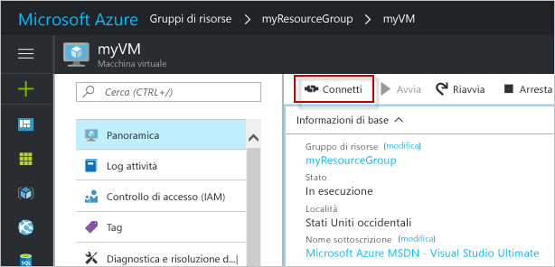

# <a name="create-a-windows-virtual-machine-with-hello-azure-portal"></a>Creare una macchina virtuale Windows con hello portale di Azure

Macchine virtuali di Azure può essere create tramite hello portale di Azure. Questo metodo fornisce un'interfaccia utente basata sul browser per la creazione e la configurazione delle macchine virtuali e di tutte le risorse correlate. Questa procedura di avvio rapido tramite la creazione di una macchina virtuale e l'installazione di un server Web in hello VM.

Se non si ha una sottoscrizione di Azure, creare un [account gratuito](https://azure.microsoft.com/free/?WT.mc_id=A261C142F) prima di iniziare.

## <a name="log-in-tooazure"></a>Accedi tooAzure

Accedi toohello portale di Azure all'indirizzo http://portal.azure.com.

## <a name="create-virtual-machine"></a>Crea macchina virtuale

1. Fare clic su hello **New** pulsante disponibile nella hello angolo superiore sinistro del portale di Azure hello.

2. Selezionare **Calcolo** e quindi **Windows Server 2016 Datacenter**. 

3. Immettere le informazioni di hello macchina virtuale. nome utente Hello e la password immessa in questo caso è toolog utilizzati nella macchina virtuale toohello. Al termine fare clic su **OK**.

      

4. Selezionare una dimensione per hello macchina virtuale. Selezionare altre dimensioni, toosee **visualizzare tutti** o modificare hello **il tipo di disco supportati** filtro. 

      

5. Nel pannello impostazioni hello, mantenere i valori predefiniti di hello e fare clic su **OK**.

6. Nella pagina Riepilogo hello, fare clic su **Ok** distribuzione della macchina virtuale toostart hello.

7. Hello VM sarà bloccato toohello dashboard del portale di Azure. Una volta completata la distribuzione di hello, verrà aperta automaticamente pannello riepilogo di hello macchina virtuale.


## <a name="connect-toovirtual-machine"></a>Connettere la macchina toovirtual

Creare una macchina virtuale di toohello connessione desktop remoto.

1. Fare clic su hello **Connetti** pulsante sulla proprietà della macchina virtuale hello. Verrà creato e scaricato un file Remote Desktop Protocol, con estensione rdp.

     

2. tooconnect tooyour macchina virtuale, aprire hello scaricato il file RDP. Se richiesto, fare clic su **Connetti**. In un Mac, è necessario un client RDP come questo [Client Desktop remoto](https://itunes.apple.com/us/app/microsoft-remote-desktop/id715768417?mt=12) da hello Mac App Store.

3. Immettere nome utente hello e la password specificata durante la creazione della macchina virtuale hello, quindi fare clic su **Ok**.

4. Si potrebbe ricevere un avviso del certificato durante il processo di accesso hello. Fare clic su **Sì** o **continua** tooproceed con connessione hello.


## <a name="install-iis-using-powershell"></a>Installare IIS tramite PowerShell

Nella macchina virtuale hello, avviare una sessione di PowerShell ed eseguire hello successivo comando tooinstall IIS.

```powershell
Install-WindowsFeature -name Web-Server -IncludeManagementTools
```

Al termine, uscire dalla sessione RDP hello e restituire le proprietà della VM hello in hello portale di Azure.

## <a name="open-port-80-for-web-traffic"></a>Aprire la porta 80 per il traffico Web 

Un gruppo di sicurezza di rete (NSG) consente il traffico in ingresso e in uscita. Quando una macchina virtuale viene creata dal portale di Azure hello, viene creata una regola in entrata sulla porta 3389 per le connessioni RDP. Poiché questa macchina virtuale ospita un server Web, una regola di gruppo deve toobe creato per la porta 80.

1. Nella macchina virtuale hello, fare clic sul nome hello di hello **gruppo di risorse**.
2. Seleziona hello **il gruppo di sicurezza di rete**. Hello gruppo può essere identificato utilizzando hello **tipo** colonna. 
3. Nel menu a sinistra di hello, in impostazioni, fare clic su **sicurezza regole connessioni in entrata**.
4. Fare clic su **Aggiungi**.
5. In **Nome** digitare **http**. Assicurarsi che **intervallo di porte** è impostato too80 e **azione** è troppo**Consenti**. 
6. Fare clic su **OK**.


## <a name="view-hello-iis-welcome-page"></a>Hello Visualizza la pagina iniziale di IIS

Con IIS installato e la porta 80 aprire tooyour VM, server Web hello è ora possibile accedere da hello internet. Aprire un web browser e immettere l'indirizzo IP pubblico hello di hello macchina virtuale. indirizzo IP pubblico Hello è reperibile nel pannello VM hello in hello portale di Azure.

 

## <a name="clean-up-resources"></a>Pulire le risorse

Quando non è più necessario, eliminare il gruppo di risorse hello, macchina virtuale e tutte le risorse correlate. toodo in tal caso, selezionare il gruppo di risorse di hello dal pannello della macchina virtuale hello e fare clic su **eliminare**.

## <a name="next-steps"></a>Passaggi successivi

In questa guida introduttiva è stata distribuita una macchina virtuale semplice, è stata creata una regola del gruppo di sicurezza di rete ed è stato installato un server Web. toolearn informazioni sulle macchine virtuali di Azure, continuare l'esercitazione toohello per le macchine virtuali di Windows.

> [!div class="nextstepaction"]
> [Esercitazioni per le macchine virtuali di Windows in Azure](./tutorial-manage-vm.md)
