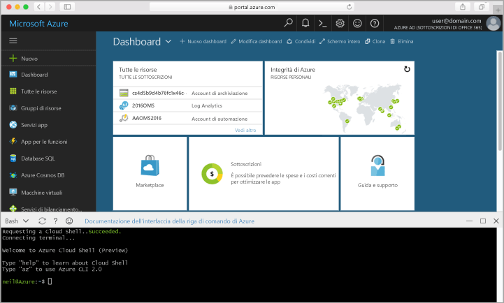

## Avviare Azure Cloud ShellLaunch Azure Cloud Shell

Hello Azure Cloud Shell è una shell Bash gratuita che è possibile eseguire direttamente all'interno di hello portale di Azure.hello Azure Cloud Shell is a free Bash shell that you can run directly within hello Azure portal. Ha hello CLI di Azure preinstallato e configurato toouse con l'account.It has hello Azure CLI preinstalled and configured toouse with your account. Fare clic su hello **Shell Cloud** pulsante hello menu in alto a destra di hello di hello [portale di Azure](https://portal.azure.com).Click hello **Cloud Shell** button on hello menu in hello upper-right of hello [Azure portal](https://portal.azure.com).

pulsante Hello viene avviata una shell interattiva che è possibile utilizzare toorun hello tutti i passaggi in questo argomento:hello button launches an interactive shell that you can use toorun all of hello steps in this topic:

