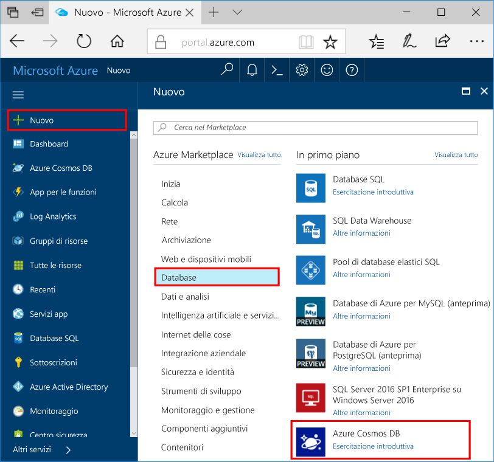
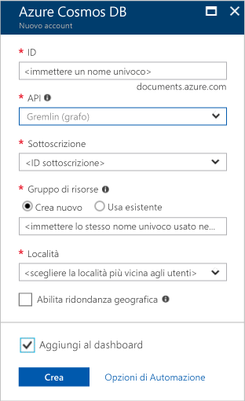

1. In una nuova finestra, accedi toohello [portale di Azure](https://portal.azure.com/).
2. Nel riquadro di sinistra hello, fare clic su **New**, fare clic su **database**, quindi in **Azure Cosmos DB**, fare clic su **crea**.
   
   

3. In hello **nuovo account** pannello, specificare la configurazione di hello desiderate per questo account di Azure Cosmos DB. 

    Con Azure Cosmos DB è possibile scegliere uno dei quattro modelli di programmazione: Gremlin (grafo), MongoDB, SQL (DocumentDB) e Tabella (chiave/valore), ognuno dei quali attualmente richiede un account separato.
       
    In questo articolo, avvio rapido è programmare hello API Graph, quindi scegliere **Gremlin (grafico)** in fase di compilazione modulo hello. Se si hanno tuttavia dati di documenti di un'app di catalogo, dati chiave/valore (tabella) o dati di cui è stata eseguita la migrazione da un'app MongoDB, tenere presente che Azure Cosmos DB può fornire una piattaforma di servizi di database con distribuzione a livello globale e a disponibilità elevata per tutte le applicazioni cruciali.

    Completare i campi di hello su hello **nuovo account** pannello, recuperando le informazioni di hello hello seguenti schermata come una guida - i valori potrebbero essere diversi da valori hello nella schermata di hello.
 
    

    Impostazione|Valore consigliato|Descrizione
    ---|---|---
    ID|*Valore univoco*|Nome univoco che identifica l'account Azure Cosmos DB. Poiché *documents.azure.com* è accodato toohello ID fornire toocreate l'URI, utilizzare univoco ma personali ID. ID Hello deve contenere solo lettere minuscole, numeri e caratteri di trattino (-) hello e deve contenere da 3 caratteri too50.
    API|Gremlin (graph)|È la programmazione hello [API Graph](../articles/cosmos-db/graph-introduction.md) più avanti in questo articolo.|
    Sottoscrizione|*Sottoscrizione in uso*|sottoscrizione di Azure che si desidera toouse per questo account di Azure Cosmos DB Hello. 
    Gruppo di risorse|*lo stesso valore ID Hello*|Hello nuovo nome gruppo di risorse per l'account. Per semplicità, è possibile utilizzare hello stesso nome come l'ID. 
    Percorso|*utenti tooyour di Hello area più vicini*|Hello località geografica in cui toohost l'account di Azure Cosmos DB. Scegliere il percorso di hello più vicino agli utenti di tooyour toogive li hello più veloce toohello di accedere ai dati.

4. Fare clic su **crea** account hello toocreate.
5. Nella barra degli strumenti superiore hello, fare clic su hello **notifiche** icona  toomonitor processo di distribuzione hello.

    

6.  Quando la finestra delle notifiche di hello indica finestra di notifica di hello distribuzione hello è stato completato, chiudere e aprire hello nuovo account da hello **tutte le risorse** riquadro hello Dashboard. 

    
