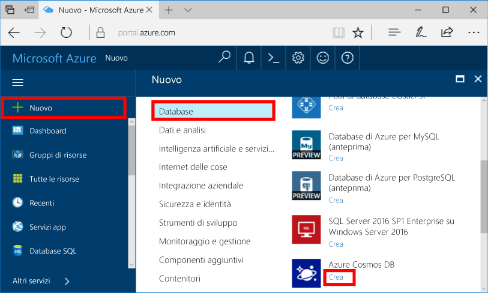
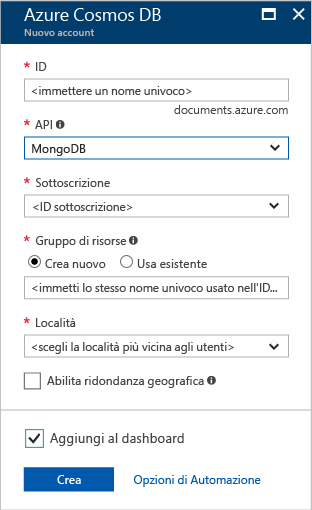
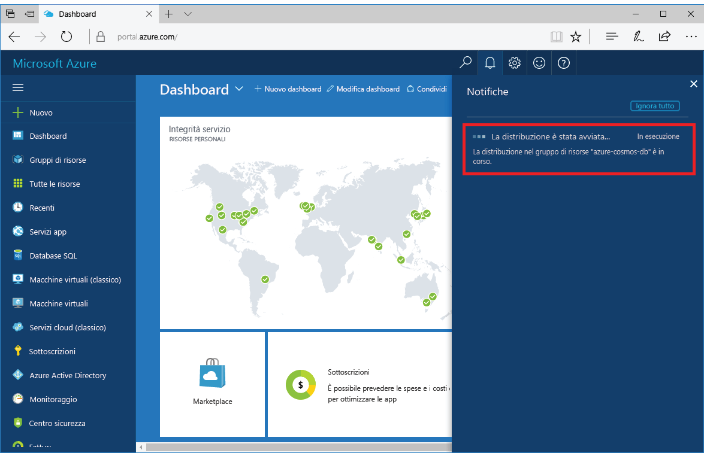
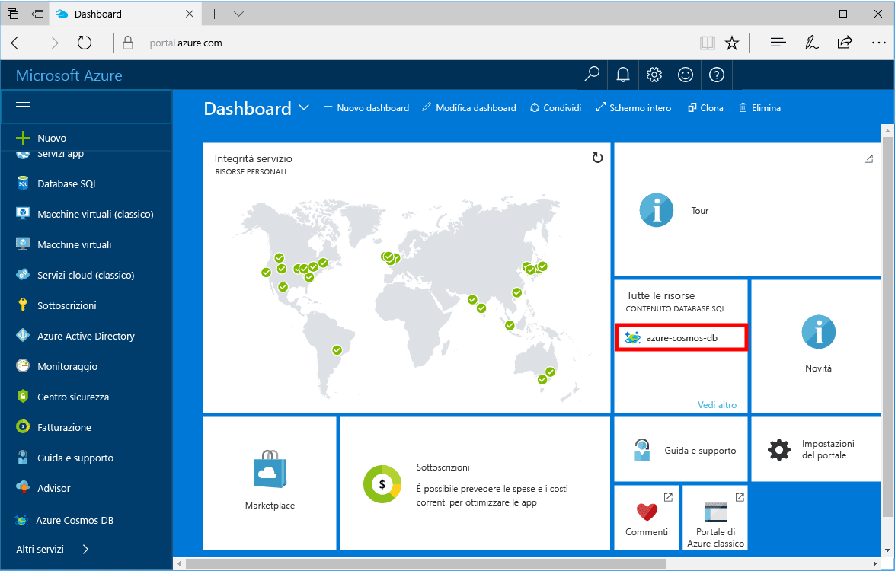

1. In una nuova finestra, accedi toohello [portale di Azure](https://portal.azure.com/).
2. Nel menu a sinistra di hello, fare clic su **New**, fare clic su **database**, quindi in **Azure Cosmos DB**, fare clic su **crea**.
   
   

3. In hello **nuovo account** pannello specificare hello configurazione desiderata per l'account di Azure Cosmos DB hello. 

    Con Azure Cosmos DB è possibile scegliere uno dei quattro modelli di programmazione: Gremlin (graph), MongoDB, SQL (DocumentDB) e Table (key-value). 
       
    In questa Guida introduttiva è sarà possibile programmazione hello MongoDB API in modo sarà possibile scegliere **MongoDB** in fase di compilazione modulo hello. Tuttavia, se si dispone di dati grafo per un'app social media, dati documento di un'app di catalogo o dati chiave-valore (tabella), tenere presente che Azure Cosmos DB può fornire una piattaforma di servizi di database distribuiti a livello globale e a disponibilità elevata per tutte le applicazioni cruciali.

    Compilare hello **nuovo account** pannello utilizzando informazioni hello nella tabella hello come guida.
 
    
   
    Impostazione|Valore consigliato|Descrizione
    ---|---|---
    ID|*Valore univoco*|Un nome univoco è scegliere l'account di Azure Cosmos DB tooidentify hello. *Documents.Azure.com* toohello accodati ID fornire toocreate l'URI, pertanto utilizzare un ID univoco ma personali. Hello ID può contenere solo lettere minuscole, numeri e hello '-' caratteri e deve essere compresa tra 3 e 50 caratteri.
    API|MongoDB|Si sarà programmazione hello [API MongoDB](../articles/documentdb/documentdb-protocol-mongodb.md) più avanti in questo articolo.|
    Sottoscrizione|*Sottoscrizione in uso*|Hello sottoscrizione di Azure che si desidera toouse per account Azure Cosmos DB hello. 
    Gruppo di risorse|*lo stesso valore ID Hello*|Hello nuovo nome gruppo di risorse per l'account. Per semplicità, è possibile utilizzare hello stesso nome come l'ID. 
    Percorso|*utenti tooyour di Hello area più vicini*|Hello località geografica in cui toohost l'account di Azure Cosmos DB. Scegliere il percorso di hello più vicino agli utenti di tooyour toogive li hello più veloce toohello di accedere ai dati.

4. Fare clic su **crea** account hello toocreate.
5. Sulla barra degli strumenti hello, fare clic su **notifiche** toomonitor processo di distribuzione hello.

    

6.  Una volta completata la distribuzione di hello, nuovo account di hello aperto da hello riquadro tutte le risorse. 

    
