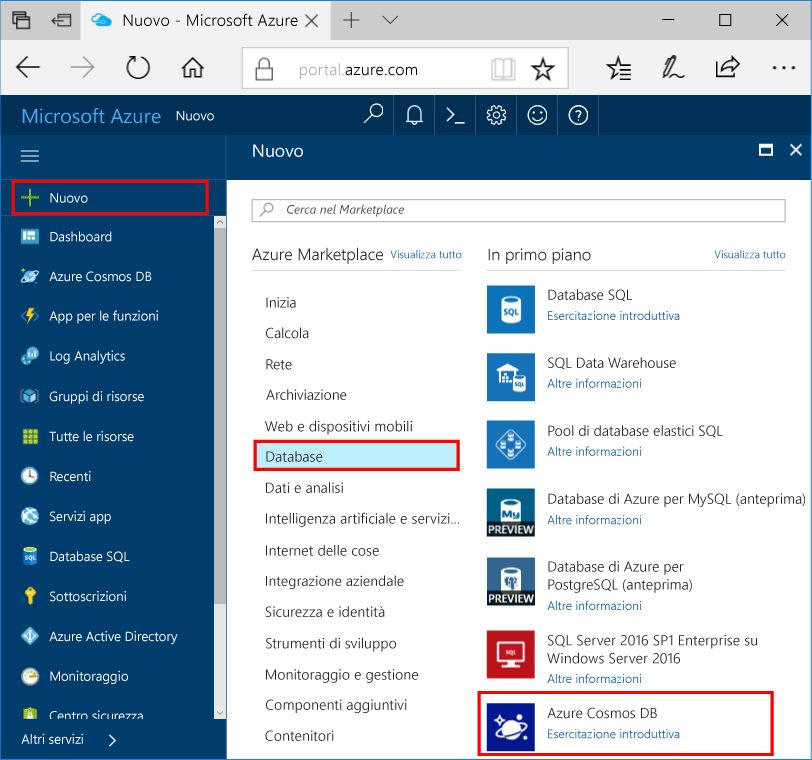

1. In una nuova finestra, accedi toohello [portale di Azure](https://portal.azure.com/).
2. Nel riquadro di sinistra hello, fare clic su **New**, fare clic su **database**, quindi in **Azure Cosmos DB**, fare clic su **crea**.
   
   

3. In hello **nuovo account** pannello, specificare la configurazione di hello desiderate per questo account di Azure Cosmos DB. 

    Con Azure Cosmos DB è possibile scegliere uno dei quattro modelli di programmazione: Gremlin (grafo), MongoDB, SQL (DocumentDB) e Tabella (chiave/valore), ognuno dei quali attualmente richiede un account separato.
    
    In questo articolo Guida introduttiva è la programmazione hello API DocumentDB, quindi scegliere **SQL (DocumentDB)** in fase di compilazione modulo hello. Se si hanno dati di grafi di un'app di social media, dati chiave/valore (tabella) o dati di cui è stata eseguita la migrazione da un'app MongoDB, tenere presente che Azure Cosmos DB può offrire una piattaforma di servizi di database con distribuzione a livello globale e a disponibilità elevata per tutte le applicazioni cruciali.

    Completare i campi di hello su hello **nuovo account** pannello, utilizzando le informazioni di hello nella seguente schermata come una Guida - hello i valori potrebbe essere diverso da valori hello nella schermata di hello.
 
    

    Impostazione|Valore consigliato|Descrizione
    ---|---|---
    ID|*Valore univoco*|Nome univoco che identifica l'account Azure Cosmos DB. Poiché *documents.azure.com* è accodato toohello ID fornire toocreate l'URI, utilizzare univoco ma personali ID. Hello ID può contenere solo lettere minuscole, numeri e caratteri di trattino (-) hello e deve contenere 3 too50 caratteri.
    API|SQL (DocumentDB)|È la programmazione hello [API DocumentDB](../articles/documentdb/documentdb-introduction.md) più avanti in questo articolo.|
    Sottoscrizione|*Sottoscrizione in uso*|sottoscrizione di Azure che si desidera toouse per questo account di Azure Cosmos DB Hello. 
    Gruppo di risorse|*lo stesso valore ID Hello*|Nome gruppo di risorse nuovo Hello per l'account. Per semplicità, è possibile utilizzare hello stesso nome come l'ID. 
    Percorso|*utenti tooyour di Hello area più vicini*|Hello località geografica in cui toohost l'account di Azure Cosmos DB. Scegliere percorso hello toogive di utenti tooyour più vicino e li hello più veloce toohello di accedere ai dati.
4. Fare clic su **crea** account hello toocreate.
5. Nella barra degli strumenti superiore hello, fare clic su hello **notifiche** icona  toomonitor processo di distribuzione hello.

    

6.  Quando la finestra delle notifiche di hello indica finestra di notifica di hello distribuzione hello è stato completato, chiudere e aprire hello nuovo account da hello **tutte le risorse** riquadro hello Dashboard. 

    
 
