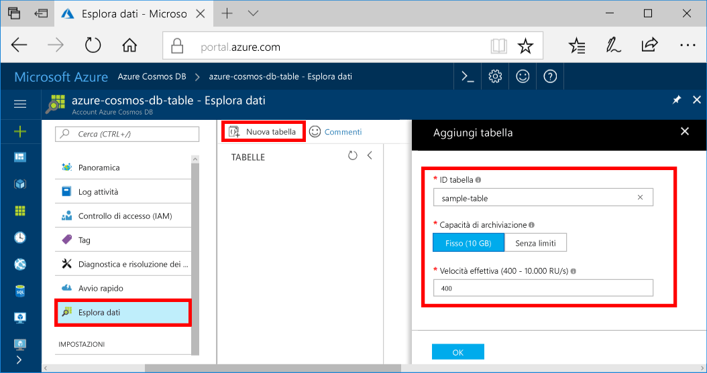

È ora possibile usare Esplora dati toocreate una tabella e aggiungere dati tooyour database.You can now use Data Explorer toocreate a table and add data tooyour database. 

1. Nel portale di Azure, nel menu di navigazione hello, hello fare clic su **Esplora dati (anteprima)**.In hello Azure portal, in hello navigation menu, click **Data Explorer (Preview)**. 
2. Nel pannello Esplora dati hello, fare clic su **nuova tabella**, quindi immettere nella pagina di hello mediante hello le seguenti informazioni.In hello Data Explorer blade, click **New Table**, then fill in hello page using hello following information.

    

    ImpostazioneSetting|Valore consigliatoSuggested value|DescrizioneDescription
    ---|---|---
    ID tabellaTable Id|sample-tablesample-table|ID di Hello della nuova tabella.hello ID for your new table. I nomi delle tabelle disporre hello stesso carattere requisiti come ID di database.Table names have hello same character requirements as database ids. I nomi dei database devono avere una lunghezza compresa tra 1 e 255 caratteri e non possono contenere `/ \ # ?` o spazi finali.Database names must be between 1 and 255 characters, and cannot contain `/ \ # ?` or a trailing space.
    Capacità di archiviazioneStorage capacity| 10 GB10 GB|Lasciare il valore di predefinito hello.Leave hello default value. Questa è la capacità di archiviazione hello del database hello.This is hello storage capacity of hello database.
    Velocità effettivaThroughput|400 UR/s400 RUs|Lasciare il valore di predefinito hello.Leave hello default value. È possibile applicare la scalabilità verticale hello [velocità effettiva](../articles/cosmos-db/request-units.md) successiva se si desidera tooreduce latenza.You can scale up hello [throughput](../articles/cosmos-db/request-units.md) later if you want tooreduce latency.

3. Una volta compilato il modulo di hello, fare clic su **OK**.Once hello form is filled out, click **OK**.
