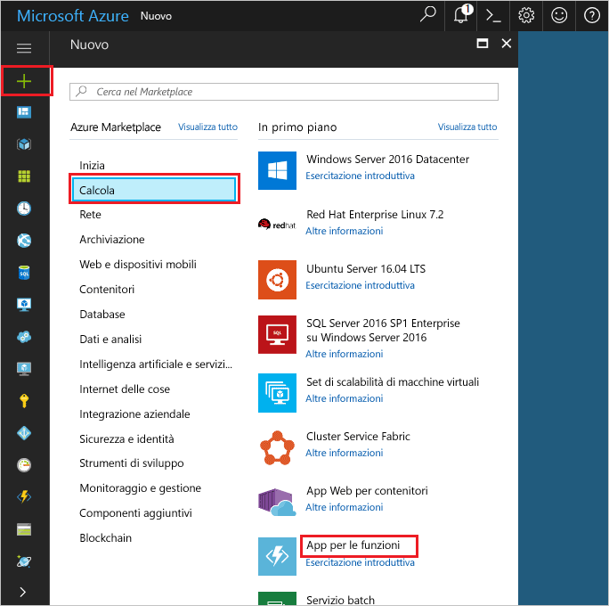

1. Fare clic su hello **New** pulsante disponibile nella hello angolo superiore sinistro del portale di Azure hello.

1. Fare clic su **Calcolo** > **App per le funzioni** e selezionare **Sottoscrizione**. Quindi, è possibile utilizzare le impostazioni dell'app di funzione hello come specificato nella tabella hello.

    

    | Impostazione      | Valore consigliato  | Descrizione                                        |
    | ------------ |  ------- | -------------------------------------------------- |
    | **Nome app** | Nome globalmente univoco | Nome che identifica la nuova app per le funzioni. | 
    | **[Gruppo di risorse](../articles/azure-resource-manager/resource-group-overview.md)** |  myResourceGroup | Assegnare un nome per hello nuovo gruppo di risorse in cui toocreate l'app di funzione. | 
    | **[Piano di hosting](../articles/azure-functions/functions-scale.md)** |   Piano a consumo | Piano di hosting che definisce la modalità di allocazione risorse tooyour funzione app. Predefinita hello **consumo pianificare**, le risorse vengono aggiunte come richiesto dalle funzioni in modo dinamico. Si paga solo per hello esecuzione delle funzioni.   |
    | **Posizione** | Europa occidentale | Scegliere una località nelle vicinanze o vicino ad altri servizi a cui accederanno le funzioni. |
    | **[Account di archiviazione](../articles/storage/common/storage-create-storage-account.md#create-a-storage-account)** |  Nome globalmente univoco |  Nome di hello nuovo account di archiviazione utilizzato dalla tua app di funzione. I nomi degli account di archiviazione devono avere una lunghezza compresa tra 3 e 24 caratteri e possono contenere solo numeri e lettere minuscole. È possibile anche usare un account esistente. |

1. Fare clic su **crea** tooprovision e distribuire hello nuova funzione app.
