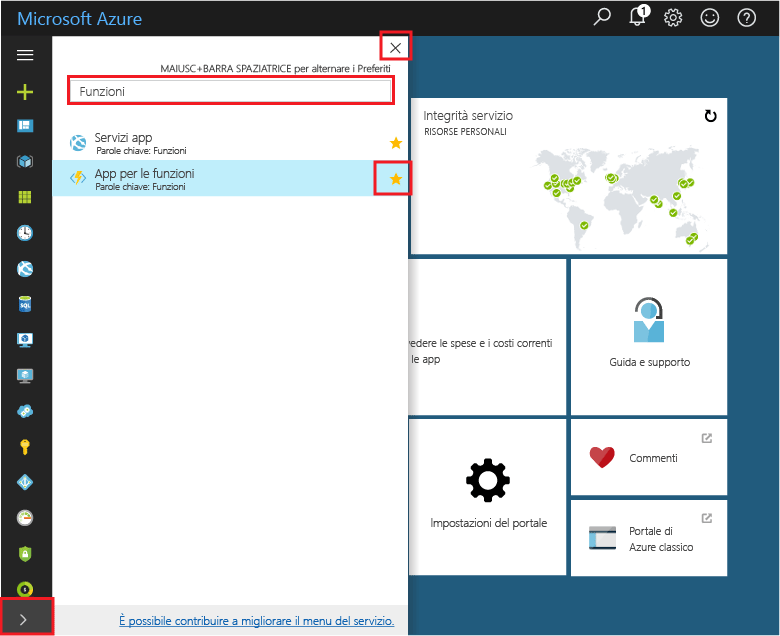
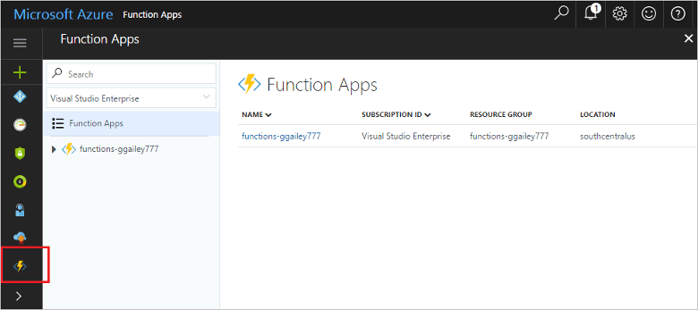

## Aggiungere App per le funzioni ai Preferiti del portaleAdd Function Apps to your portal favorites 

Se non è già stato fatto, aggiungere App per le funzioni ai Preferiti del portale di Azure,If you haven't already done so, add Function Apps to your favorites in the Azure portal. in modo da trovare più facilmente le app per le funzioni.This makes it easier to find your function apps. Se è stato già fatto, passare alla sezione successiva.If you have already done this, skip to the next section. 

1. Accedere al [Portale di Azure](https://portal.azure.com/).Log in to the [Azure portal](https://portal.azure.com/).

2. Fare clic sulla freccia in basso a sinistra per espandere tutti i servizi, digitare `Functions` nel campo **Filtro** e quindi fare clic sulla stella accanto a **App per le funzioni**.Click the arrow at the bottom left to expand all services, type `Functions` in the **Filter** field, and then click the star next to **Function Apps**.  
 
    

    L'icona Funzioni viene aggiunta al menu disponibile nella parte sinistra del portale.This adds the Functions icon to the menu on the left of the portal.

3. Chiudere il menu e scorrere verso il basso fino a trovare l'icona Funzioni.Close the menu, then scroll down to the bottom to see the Functions icon. Fare clic sull'icona per visualizzare l'elenco di tutte le app per le funzioni.Click this icon to see a list of all your function apps. Fare clic sull'app per le funzioni per eseguire operazioni sulle funzioni all'interno dell'app.Click your function app to work with functions in this app. 
 
    
 
     