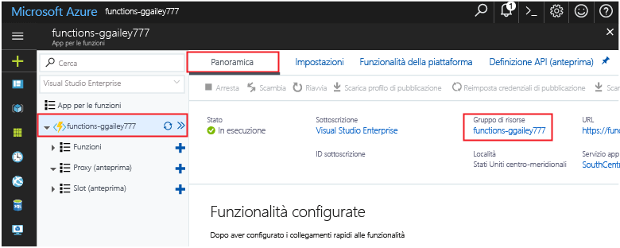

Altre guide introduttive di questa raccolta si basano sui valori di questa guida introduttiva. Se si intende toocontinue toowork con avvio rapido successive o con le esercitazioni di hello, non le risorse di hello create in questa Guida introduttiva di pulizia avviata. 

Se non si prevede toocontinue, fare clic su hello **gruppo di risorse** per app di funzione hello in portale hello e quindi fare clic su **eliminare**. 

