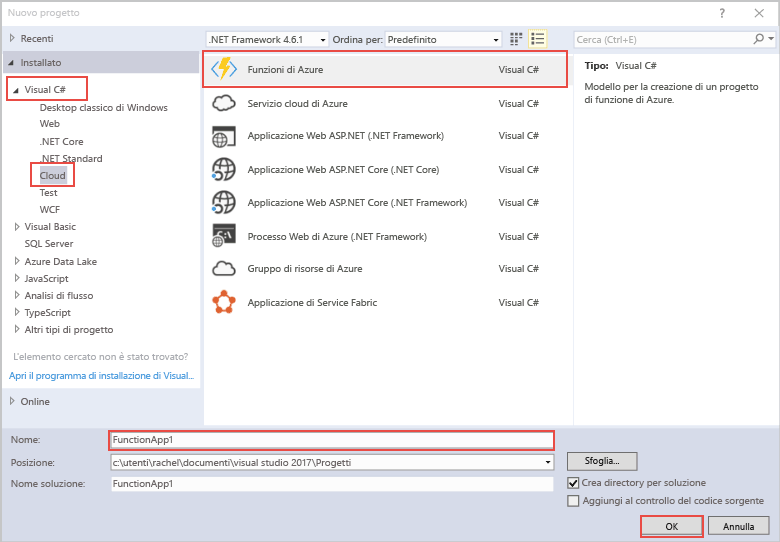

modello di progetto di Azure funzioni Hello in Visual Studio crea un progetto che può essere pubblicati tooa funzione app in Azure. Un'app per le funzioni consente di raggruppare le funzioni come un'unità logica per semplificare la gestione, la distribuzione e la condivisione delle risorse.   

1. Il pulsante destro del mouse sul nodo progetto hello in **Esplora**, quindi scegliere **Aggiungi** > **nuovo elemento**. Scegliere **funzione Azure** dalla finestra di dialogo hello.

2. In hello **nuovo progetto** finestra di dialogo espandere **Visual c#** > **Cloud** nodo, seleziona **Azure funzioni**, digitare un **Nome** per il progetto e fare clic su **OK**. nome della funzione app Hello deve essere validi c# spazio dei nomi, in modo da non utilizzare altri caratteri non alfanumerici, trattini o caratteri di sottolineatura. 

    
