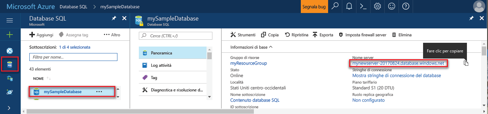

## Accedi toohello portale di AzureLog in toohello Azure portal

Accedi toohello [portale di Azure](https://portal.azure.com/).Log in toohello [Azure portal](https://portal.azure.com/).

## Creare un database SQL vuoto utilizzando hello portale di AzureCreate a blank SQL database using hello Azure portal

Un database SQL di Azure viene creato con un set definito di [risorse di calcolo e di archiviazione](../articles/sql-database/sql-database-service-tiers.md).An Azure SQL database is created with a defined set of [compute and storage resources](../articles/sql-database/sql-database-service-tiers.md). Hello database viene creato all'interno di un [gruppo di risorse](../articles/azure-resource-manager/resource-group-overview.md) e in un [server logico di Database SQL di Azure](../articles/sql-database/sql-database-features.md).hello database is created within an [Azure resource group](../articles/azure-resource-manager/resource-group-overview.md) and in an [Azure SQL Database logical server](../articles/sql-database/sql-database-features.md). 

Seguire questi toocreate passaggi un database SQL vuoto.Follow these steps toocreate a blank SQL database. 

1. Fare clic su hello **New** pulsante disponibile nella hello angolo superiore sinistro del portale di Azure hello.Click hello **New** button found on hello upper left-hand corner of hello Azure portal.

2. Selezionare **database** da hello **New** pagina e selezionare **Database SQL** da hello **database** pagina.Select **Databases** from hello **New** page, and select **SQL Database** from hello **Databases** page. 

   

3. Compilare il modulo di Database SQL hello con hello le seguenti informazioni, come mostrato nella precedente immagine hello:Fill out hello SQL Database form with hello following information, as shown on hello preceding image:   

   | ImpostazioneSetting | Valore consigliatoSuggested value | DescrizioneDescription |
   | --------| --------------- | ----------- | 
   | **Database name** (Nome database)**Database name** | mySampleDatabasemySampleDatabase | Per i nomi di database validi, vedere [Database Identifiers](https://docs.microsoft.com/sql/relational-databases/databases/database-identifiers) (Identificatori di database).For valid database names, see [Database Identifiers](https://docs.microsoft.com/sql/relational-databases/databases/database-identifiers). | 
   | **Sottoscrizione****Subscription** | Sottoscrizione in usoYour subscription  | Per informazioni dettagliate sulle sottoscrizioni, vedere [Subscriptions](https://account.windowsazure.com/Subscriptions) (Sottoscrizioni).For details about your subscriptions, see [Subscriptions](https://account.windowsazure.com/Subscriptions). |
   | **Gruppo di risorse****Resource group** | myResourceGroupmyResourceGroup | Per i nomi di gruppi di risorse validi, vedere [Naming rules and restrictions](https://docs.microsoft.com/azure/architecture/best-practices/naming-conventions) (Regole di denominazione e restrizioni).For valid resource group names, see [Naming rules and restrictions](https://docs.microsoft.com/azure/architecture/best-practices/naming-conventions). |
   | **Select source** (Seleziona origine)**Select source** | Database vuotoBlank database | Indica che deve essere creato un database vuoto.Specifies that a blank database should be created. |
   ||||

4. Fare clic su **Server** toocreate e configurare un nuovo server per il nuovo database.Click **Server** toocreate and configure a new server for your new database. Compilare hello **nuovo modulo server** con hello le seguenti informazioni:Fill out hello **New server form** with hello following information: 

   | ImpostazioneSetting | Valore consigliatoSuggested value | DescrizioneDescription |
   | --------| --------------- | ----------- | 
   | **Server name** (Nome server)**Server name** | Qualsiasi nome univoco globale.Any globally unique name. | Per i nomi di server validi, vedere [Naming rules and restrictions](https://docs.microsoft.com/azure/architecture/best-practices/naming-conventions) (Regole di denominazione e restrizioni).For valid server names, see [Naming rules and restrictions](https://docs.microsoft.com/azure/architecture/best-practices/naming-conventions). | 
   | **Nome di accesso amministratore server****Server admin login** | Qualsiasi nome valido.Any valid name. | Per i nomi di accesso validi, vedere [Database Identifiers](https://docs.microsoft.com/sql/relational-databases/databases/database-identifiers) (Identificatori di database).For valid login names, see [Database Identifiers](https://docs.microsoft.com/sql/relational-databases/databases/database-identifiers).|
   | **Password****Password** | Qualsiasi password valida.Any valid password. | La password deve contenere almeno otto caratteri e deve contenere caratteri di tre delle seguenti categorie di hello: lettere maiuscole, lettere minuscole, numeri e caratteri non alfanumerici.Your password must have at least eight characters and must contain characters from three of hello following categories: upper case characters, lower case characters, numbers, and non-alphanumeric characters. |
   | **Posizione****Location** | Qualsiasi posizione valida.Any valid location. | Per informazioni sulle aree, vedere [Aree di Azure](https://azure.microsoft.com/regions/).For information about regions, see [Azure Regions](https://azure.microsoft.com/regions/). |
   ||||

   

5. Fare clic su **Seleziona**.Click **Select**.

6. Fare clic su **tariffario** toospecify hello servizio livello di prestazioni e per il nuovo database.Click **Pricing tier** toospecify hello service tier and performance level for your new database. Per esercitazione selezionare **20 DTU** e **250** GB di memoria.For this tutorial, select **20 DTUs** and **250** GB of storage.

   

7. Fare clic su **Apply**.Click **Apply**.  

8. Selezionare un **delle regole di confronto** per database vuoto di hello (per questa esercitazione, hello Usa il valore predefinito).Select a **collation** for hello blank database (for this tutorial, use hello default value). Per altre informazioni sulle regole di confronto, vedere [Collations](https://docs.microsoft.com/sql/t-sql/statements/collations) (Regole di confronto)For more information about collations, see [Collations](https://docs.microsoft.com/sql/t-sql/statements/collations)

9. Fare clic su **crea** database hello tooprovision.Click **Create** tooprovision hello database. Provisioning richiede circa un minuto e mezzo di toocomplete.Provisioning takes about a minute and a half toocomplete. 

10. Sulla barra degli strumenti hello, fare clic su **notifiche** toomonitor processo di distribuzione hello.On hello toolbar, click **Notifications** toomonitor hello deployment process.

   

## Creare una regola firewall di livello server tramite hello portale di AzureCreate a server-level firewall rule using hello Azure portal

Hello servizio Database SQL consente di creare un firewall a livello di server hello.hello SQL Database service creates a firewall at hello server-level. Inizialmente hello firewall impedisce il strumenti esterni e le applicazioni si connettano toohello server o database tooany hello server.Initially hello firewall prevents external tools and applications from connecting toohello server, or tooany databases on hello server. Dopo aver creata una regola del firewall tooopen specifici indirizzi IP, sono consentite connessioni.Connections are allowed after a firewall rule is created tooopen specific IP addresses. Seguire questi passaggi toocreate un [regola del firewall a livello di server SQL Database](../articles/sql-database/sql-database-firewall-configure.md) per l'indirizzo IP del client e tooenable connettività esterna tramite firewall del Database SQL hello per solo l'indirizzo IP.Follow these steps toocreate a [SQL Database server-level firewall rule](../articles/sql-database/sql-database-firewall-configure.md) for your client's IP address, and tooenable external connectivity through hello SQL Database firewall for your IP address only. 

> [!NOTE]
> Il database SQL di Azure comunica sulla porta 1433.Azure SQL Database communicates over port 1433. È possibile connettersi tooSQL Database solo dopo che il firewall di hello della rete consenta il traffico in uscita attraverso la porta 1433.You can connect tooSQL Database only after hello firewall of your network allows outbound traffic through port 1433.

1. Al termine della distribuzione di hello, fare clic su **database SQL** dal menu a sinistra di hello e quindi fare clic su **mySampleDatabase** su hello **database SQL** pagina.After hello deployment completes, click **SQL databases** from hello left-hand menu and then click **mySampleDatabase** on hello **SQL databases** page. pagina di panoramica per l'apertura del database, che mostra hello completamente Hello completo del server (ad esempio **mynewserver20170313.database.windows.net**) e offre opzioni per un'ulteriore configurazione.hello overview page for your database opens, showing you hello fully qualified server name (such as **mynewserver20170313.database.windows.net**) and provides options for further configuration. Copiare il nome completo del server per usarlo in seguito.Copy this fully qualified server name for use later.

   > [!IMPORTANT]
   > È necessario il server di tooyour tooconnect nome completo del server e i relativi database nelle successive guide introduttive.You need this fully qualified server name tooconnect tooyour server and its databases in subsequent quick starts.
   > 

    

2. Fare clic su **impostare firewall server** sulla barra degli strumenti hello, come illustrato nella figura precedente hello.Click **Set server firewall** on hello toolbar as shown in hello previous image. Hello **le impostazioni del Firewall** verrà visualizzata la pagina per il server di Database SQL di hello.hello **Firewall settings** page for hello SQL Database server opens. 

    

3. Fare clic su **Aggiungi indirizzo IP del client** su hello barra degli strumenti tooadd il corrente l'indirizzo IP di tooa nuova regola del firewall.Click **Add client IP** on hello toolbar tooadd your current IP address tooa new firewall rule. Una regola del firewall può aprire la porta 1433 per un indirizzo IP singolo o un intervallo di indirizzi IP.A firewall rule can open port 1433 for a single IP address or a range of IP addresses.

4. Fare clic su **Salva**.Click **Save**. Una regola del firewall a livello di server viene creata per l'indirizzo IP corrente, aprire la porta 1433 sul server logico hello.A server-level firewall rule is created for your current IP address opening port 1433 on hello logical server.

    

4. Fare clic su **OK** e quindi chiudere hello **le impostazioni del Firewall** pagina.Click **OK** and then close hello **Firewall settings** page.

È ora possibile connettersi toohello server di Database SQL di Azure e i relativi database tramite uno strumento, ad esempio SQL Server Management Studio (SSMS).You can now connect toohello Azure SQL Database server and its databases by using a tool such as SQL Server Management Studio (SSMS). connessione Hello è da questo indirizzo IP e viene utilizzato l'account amministratore di server hello creato in precedenza.hello connection is from this IP address, and it uses hello server admin account created previously.

> [!IMPORTANT]
> Per impostazione predefinita, l'accesso attraverso il firewall di Database SQL hello è abilitato per tutti i servizi di Azure.By default, access through hello SQL Database firewall is enabled for all Azure services. Fare clic su **OFF** su toodisable questa pagina per tutti i servizi di Azure.Click **OFF** on this page toodisable for all Azure services.

## Ottenere i valori di stringa di connessione utilizzando hello portale di AzureGet connection string values using hello Azure portal

Ottenere hello nome completo del server per il server di Database SQL di Azure nel portale di Azure hello.Get hello fully qualified server name for your Azure SQL Database server in hello Azure portal. Utilizzare hello server completo tooconnect tooyour server dei nomi utilizzando SQL Server Management Studio.You use hello fully qualified server name tooconnect tooyour server using SQL Server Management Studio.

1. Accedi toohello [portale di Azure](https://portal.azure.com/).Log in toohello [Azure portal](https://portal.azure.com/).

2. Selezionare **database SQL** dal menu a sinistra di hello, scegliere il database in hello **database SQL** pagina.Select **SQL Databases** from hello left-hand menu, and click your database on hello **SQL databases** page. 

3. In hello **Essentials** riquadro hello pagina del portale Azure per il database, individuare e copiare hello **nome Server**.In hello **Essentials** pane in hello Azure portal page for your database, locate and then copy hello **Server name**.

    
